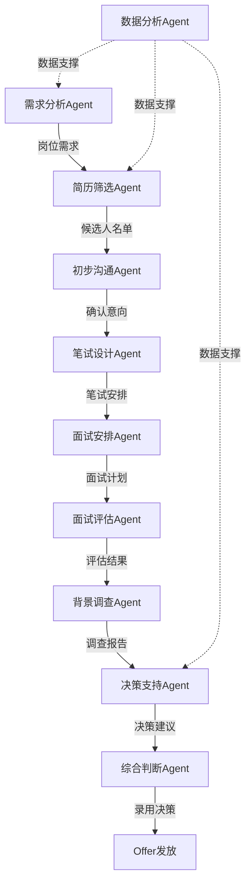

# 律师事务所智能招聘系统

面向中国律师事务所的专业招聘Agent团队系统，覆盖招聘全流程。10个专业Agent角色协同工作，实现高效、精准的人才选拔。

## 安装

```bash
claude plugins add law-firm-recruitment
```

## Agent团队架构

```
┌─────────────────────────────────────────────────────────────────┐
│                     律师事务所招聘Agent团队                        │
├─────────────────────────────────────────────────────────────────┤
│                                                                 │
│  ┌──────────────┐    ┌──────────────┐    ┌──────────────┐      │
│  │  需求分析Agent │───▶│  简历筛选Agent │───▶│ 初步沟通Agent │      │
│  └──────────────┘    └──────────────┘    └──────────────┘      │
│         │                                        │              │
│         ▼                                        ▼              │
│  ┌──────────────┐    ┌──────────────┐    ┌──────────────┐      │
│  │  笔试设计Agent │◀──│  面试安排Agent │◀──│  面试评估Agent │      │
│  └──────────────┘    └──────────────┘    └──────────────┘      │
│         │                                        │              │
│         ▼                                        ▼              │
│  ┌──────────────┐    ┌──────────────┐    ┌──────────────┐      │
│  │  数据分析Agent │◀──│  决策支持Agent │◀──│  背景调查Agent │      │
│  └──────────────┘    └──────────────┘    └──────────────┘      │
│         │                                        │              │
│         └──────────────┬─────────────────────────┘              │
│                        ▼                                        │
│               ┌──────────────┐                                  │
│               │ 综合判断Agent │                                  │
│               └──────────────┘                                  │
│                                                                 │
└─────────────────────────────────────────────────────────────────┘
```

## Agent角色说明

| Agent | 角色职责 | 触发方式 |
|-------|---------|---------|
| **需求分析** | 分析岗位需求、任职资格、团队匹配度 | `/需求分析` 或 "招聘需求" |
| **简历筛选** | 简历解析、关键词匹配、初筛评分 | `/简历筛选` 或 "筛选简历" |
| **初步沟通** | 候选人联系、意向确认、基础信息收集 | `/初步沟通` 或 "联系候选人" |
| **笔试设计** | 法律专业知识笔试题目设计与评分标准 | `/笔试设计` 或 "设计笔试" |
| **面试安排** | 时间协调、面试官安排、场地预约 | `/面试安排` 或 "安排面试" |
| **面试评估** | 面试记录、能力评估、综合打分 | `/面试评估` 或 "评估面试" |
| **背景调查** | 学历核实、执业经历、诚信记录核查 | `/背景调查` 或 "背调" |
| **决策支持** | 优劣势分析、录用建议、薪酬建议 | `/决策支持` 或 "录用建议" |
| **数据分析** | 招聘漏斗、转化率、渠道效果分析 | `/数据分析` 或 "招聘数据" |
| **综合判断** | 多维度信息整合、最终录用决策 | `/综合判断` 或 "最终决策" |

## 核心功能

### 1. 岗位需求智能分析

```
/需求分析
```

基于律所业务特点，分析岗位需求：
- 执业领域匹配（民商事、刑事、非诉等）
- 执业年限与经验要求
- 执业资格要求（律师执业证A/B/C证）
- 团队协作与文化匹配度

### 2. 简历智能筛选

```
/简历筛选
```

自动化简历处理：
- 教育背景解析（法学院校层级）
- 执业经历提取（律所规模、业务类型）
- 专业能力识别（胜诉率、案例质量）
- 匹配度评分与排序

### 3. 专业笔试设计

```
/笔试设计
```

针对律师岗位的专业测试：
- 法律文书写作
- 案例分析
- 法律检索能力
- 专业英语（涉外业务）

### 4. 结构化面试评估

```
/面试评估
```

多维度面试评估体系：
- 专业能力（40%）
- 沟通表达（20%）
- 逻辑思维（20%）
- 职业素养（20%）

### 5. 全流程数据分析

```
/数据分析
```

招聘效果追踪：
- 招聘漏斗分析
- 渠道ROI评估
- 招聘周期统计
- 录用质量跟踪

## 协作流程



## 使用示例

### 示例1：新增招聘需求

```
我们需要招聘一名民商事诉讼律师，要求：
- 3年以上执业经验
- 有独立办案能力
- 宁波本地执业优先
```

需求分析Agent将自动解析并生成岗位画像。

### 示例2：批量简历筛选

```
请筛选这批应聘民商事律师的简历，重点关注：
- 是否有独立办理民商事案件经验
- 胜诉率情况
- 是否有物业公司、业主委员会服务经验
```

简历筛选Agent将按维度打分并排序输出。

### 示例3：面试评估汇总

```
汇总张三的面试评估，给出录用建议
```

综合判断Agent将整合所有评估信息，输出最终建议。

## 配置文件

在 `law-firm-recruitment/.claude/settings.local.json` 中配置：

```json
{
  "firm": {
    "name": "北京康达（宁波）律师事务所",
    "location": "宁波市鄞州区三眼桥街51号宁波塔27层",
    "size": "50-100人",
    "practiceAreas": ["民商事诉讼", "刑事辩护", "公司法律顾问", "物居业纠纷"]
  },
  "recruitment": {
    "channels": ["智联招聘", "BOSS直聘", "法学就业网", "内推"],
    "assessmentWeights": {
      "professional": 40,
      "communication": 20,
      "logic": 20,
      "ethics": 20
    },
    "salaryBands": {
      "associate": "8k-15k",
      "seniorAssociate": "15k-25k",
      "partner": "面议"
    }
  }
}
```

## 适用场景

- **律师助理招聘**：应届法学毕业生、实习生
- **执业律师招聘**：有独立办案经验的律师
- **合伙人引进**：资深律师、团队带头人
- **行政人员招聘**：律所行政、财务、市场等岗位

## 注意事项

1. 律师执业信息需通过司法局官网核实
2. 背景调查需获得候选人书面授权
3. 薪酬建议参考当地律师行业薪酬水平
4. 录用决策需合伙人会议审议

## 版本历史

- **1.0.0** - 初始版本，包含10个Agent角色完整功能
