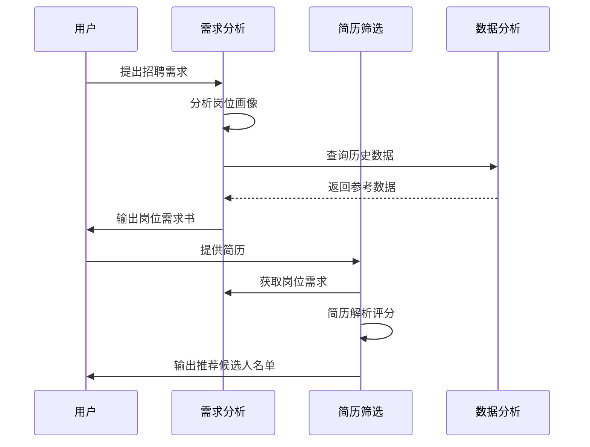
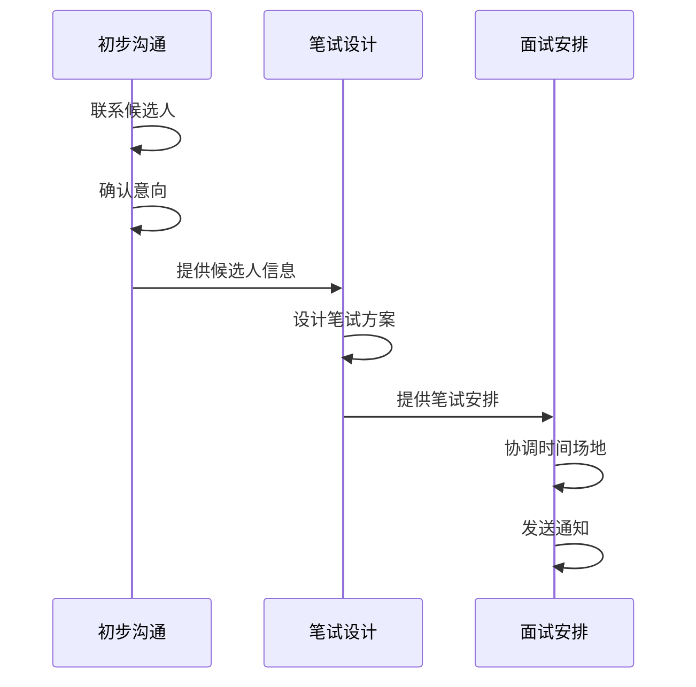
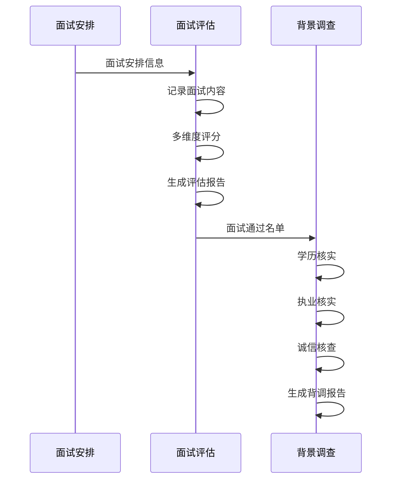
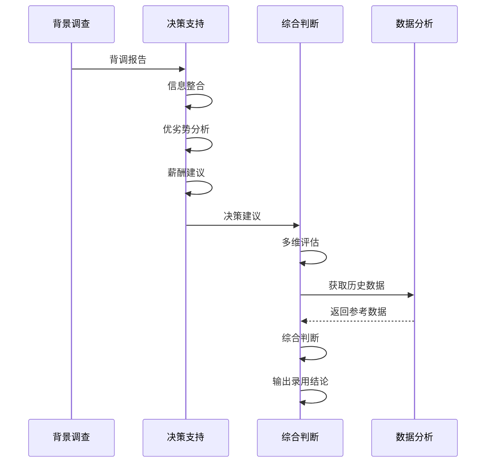

# Agent协作流程

本文档定义了律师事务所招聘Agent团队中10个角色之间的协作关系和工作流程。

## Agent角色概览

| 序号 | Agent名称 | 核心职责 | 输入 | 输出 |
|------|----------|---------|------|------|
| 1 | 需求分析 | 岗位需求分析 | 用户需求 | 岗位需求书 |
| 2 | 简历筛选 | 简历初筛评分 | 岗位需求+简历 | 候选人名单 |
| 3 | 初步沟通 | 意向确认 | 候选人名单 | 沟通记录 |
| 4 | 笔试设计 | 题目设计评分 | 岗位需求 | 笔试方案 |
| 5 | 面试安排 | 时间协调 | 笔试成绩 | 面试安排 |
| 6 | 面试评估 | 能力评估 | 面试记录 | 评估报告 |
| 7 | 背景调查 | 信息核实 | 面试通过名单 | 背调报告 |
| 8 | 决策支持 | 录用建议 | 背调报告 | 决策建议 |
| 9 | 数据分析 | 数据支撑 | 全流程数据 | 分析报告 |
| 10 | 综合判断 | 最终决策 | 全流程信息 | 录用结论 |

## 协作关系图

```
                                    ┌─────────────────┐
                                    │    用户需求     │
                                    └────────┬────────┘
                                             │
                                             ▼
┌─────────────────────────────────────────────────────────────────────────┐
│                                                                         │
│   ┌──────────────┐                                                     │
│   │ 需求分析Agent │◀──────────────────────────────────┐                │
│   └──────┬───────┘                                   │                │
│          │                                           │                │
│          ▼ 岗位需求书                                │                │
│   ┌──────────────┐                                   │                │
│   │ 简历筛选Agent │                                   │                │
│   └──────┬───────┘                                   │                │
│          │                                           │                │
│          ▼ 候选人名单                                │                │
│   ┌──────────────┐                                   │                │
│   │ 初步沟通Agent │                                   │                │
│   └──────┬───────┘                                   │                │
│          │                                           │                │
│          ▼ 意向确认                                  │                │
│   ┌──────────────┐     ┌──────────────┐             │                │
│   │ 笔试设计Agent │────▶│ 面试安排Agent │             │                │
│   └──────────────┘     └──────┬───────┘             │                │
│          ▲                    │                      │                │
│          │                    ▼ 面试安排             │                │
│          │            ┌──────────────┐              │                │
│          │            │ 面试评估Agent │              │                │
│          │            └──────┬───────┘              │                │
│          │                   │                      │                │
│          │                   ▼ 评估报告             │                │
│          │            ┌──────────────┐              │                │
│          │            │ 背景调查Agent │              │                │
│          │            └──────┬───────┘              │                │
│          │                   │                      │                │
│          │                   ▼ 背调报告             │                │
│          │            ┌──────────────┐              │                │
│          │            │ 决策支持Agent │              │                │
│          │            └──────┬───────┘              │                │
│          │                   │                      │                │
│          │                   ▼ 决策建议             │                │
│          │            ┌──────────────┐              │                │
│          │            │ 综合判断Agent │──────────────┘                │
│          │            └──────┬───────┘                               │
│          │                   │                                       │
│          │                   ▼ 录用结论                              │
│          │            ┌──────────────┐                               │
│          │            │   Offer发放  │                               │
│          │            └──────────────┘                               │
│          │                                                           │
│          │              ┌──────────────┐                             │
│          └──────────────│ 数据分析Agent │                             │
│             (数据支撑)   └──────────────┘                             │
│                                                                         │
└─────────────────────────────────────────────────────────────────────────┘
```

## 主流程

### 阶段一：需求与筛选



### 阶段二：沟通与笔试



### 阶段三：面试与评估



### 阶段四：决策与录用



## 数据流转

```
┌─────────────────────────────────────────────────────────────────────┐
│                         数据流转关系                                 │
├─────────────────────────────────────────────────────────────────────┤
│                                                                     │
│  【岗位数据】                                                        │
│  需求分析 ──────────────────────────────────────────┐              │
│       │                                             │              │
│       ▼                                             ▼              │
│  简历筛选 ◀─────────────────────────────────── 笔试设计             │
│       │                                             │              │
│       ▼                                             ▼              │
│  【候选人数据】                                  面试安排             │
│  初步沟通 ◀───────────────────────────────────────┘              │
│       │                                                            │
│       ▼                                                            │
│  面试评估                                                          │
│       │                                                            │
│       ▼                                                            │
│  背景调查                                                          │
│       │                                                            │
│       ▼                                                            │
│  决策支持                                                          │
│       │                                                            │
│       ▼                                                            │
│  综合判断                                                          │
│       │                                                            │
│       ▼                                                            │
│  【录用数据】                                                       │
│  Offer发放                                                         │
│                                                                     │
│  ═══════════════════════════════════════════════════════════════   │
│                                                                     │
│  【数据支撑层】                                                      │
│                                                                     │
│  数据分析Agent ◀────────── 收集各环节数据                           │
│       │                                                            │
│       ├──▶ 需求分析：历史招聘需求、岗位画像参考                      │
│       ├──▶ 简历筛选：筛选标准参考、历史匹配度数据                    │
│       ├──▶ 面试安排：面试官时间、场地资源                           │
│       ├──▶ 决策支持：薪酬参考、历史录用数据                         │
│       └──▶ 综合判断：综合评估参考、风险案例                         │
│                                                                     │
└─────────────────────────────────────────────────────────────────────┘
```

## 异常处理流程

### 简历不足

```
简历筛选Agent 检测到简历不足
        │
        ▼
通知 需求分析Agent
        │
        ▼
需求分析Agent 建议调整：
  ├── 放宽筛选条件
  ├── 拓展招聘渠道
  └── 调整岗位要求
        │
        ▼
用户决策
```

### 面试不通过

```
面试评估Agent 评估不通过
        │
        ▼
记录评估结果
        │
        ▼
通知 简历筛选Agent
        │
        ▼
简历筛选Agent 提供：
  ├── 其他候选人
  └── 建议重新筛选
```

### 背调异常

```
背景调查Agent 发现异常
        │
        ▼
评估异常严重程度
        │
        ├── 低风险 ──▶ 记录，继续流程
        │
        ├── 中风险 ──▶ 通知 决策支持Agent
        │                    │
        │                    ▼
        │               综合评估后决策
        │
        └── 高风险 ──▶ 通知 综合判断Agent
                             │
                             ▼
                        建议不予录用
```

### Offer被拒

```
综合判断Agent Offer被拒
        │
        ▼
记录拒绝原因
        │
        ▼
通知 决策支持Agent
        │
        ▼
决策支持Agent 分析：
  ├── 薪酬差距
  ├── 其他offer竞争
  └── 候选人顾虑
        │
        ▼
提供备选方案：
  ├── 调整薪酬（如可行）
  ├── 启动备选候选人
  └── 重新评估需求
```

## 协作规范

### 信息传递规范

| 信息类型 | 传递方式 | 格式要求 |
|---------|---------|---------|
| 岗位需求 | 结构化文档 | 岗位需求书模板 |
| 候选人信息 | 结构化数据 | 候选人档案模板 |
| 评估结果 | 评分+文字 | 评估表模板 |
| 决策建议 | 结构化报告 | 决策建议书模板 |

### 时间要求

| 环节 | 标准时效 | 最长时效 |
|------|---------|---------|
| 需求分析 | 1个工作日 | 2个工作日 |
| 简历筛选 | 2个工作日 | 3个工作日 |
| 初步沟通 | 3个工作日 | 5个工作日 |
| 笔试安排 | 1周内 | 2周内 |
| 面试评估 | 面试后1日 | 面试后2日 |
| 背景调查 | 3-5个工作日 | 7个工作日 |
| 综合判断 | 1个工作日 | 2个工作日 |

### 质量标准

| Agent | 质量指标 | 目标值 |
|-------|---------|--------|
| 需求分析 | 需求准确率 | ≥95% |
| 简历筛选 | 筛选准确率 | ≥80% |
| 初步沟通 | 联络成功率 | ≥90% |
| 笔试设计 | 题目有效性 | ≥85% |
| 面试评估 | 评估一致性 | ≥85% |
| 背景调查 | 核实准确率 | 100% |
| 综合判断 | 录用质量 | ≥90% |

## 附录：模板索引

| 模板名称 | 所属Agent | 用途 |
|---------|----------|------|
| 岗位需求书 | 需求分析 | 定义岗位需求 |
| 简历评分卡 | 简历筛选 | 简历评估打分 |
| 沟通记录表 | 初步沟通 | 记录沟通内容 |
| 笔试方案 | 笔试设计 | 笔试安排 |
| 面试评估表 | 面试评估 | 面试评分 |
| 背调报告 | 背景调查 | 背调结果 |
| 决策建议书 | 决策支持 | 录用建议 |
| 综合评估报告 | 综合判断 | 最终决策 |
